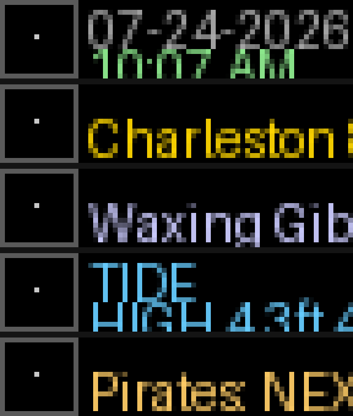

# BusyBar Dashboard

A continuous scrolling ticker for BUSY Bar showing:

- Date/time (MM-DD-YYYY, 12-hour clock), synced to network time (NTP,
  resynced hourly) rather than trusting the system clock, with a live
  calendar icon showing today's actual date
- Weather for Charleston, SC (current temp + today's high/low, via Open-Meteo)
- Moon phase (calculated locally, no API)
- Charleston Harbor tide predictions (NOAA Tides & Currents, station 8665530)
- Season-aware sports scores/schedule: Pittsburgh Pirates, Pittsburgh Steelers,
  West Virginia Mountaineers, South Carolina Gamecocks, Clemson Tigers (via ESPN)

Everything above is just the *default* config -- see
[Configuring this for your own city/team](#configuring-this-for-your-own-cityteam)
to point it at a different location, tide station, and set of teams without
touching any code.



*Illustrative renders built from the dashboard's actual draw-API payloads
(exact text/colors/layout, real font substituted) -- not literal photos of
the LED matrix. See [Testing without hardware](#testing-without-hardware-the-busy-bar-emulator)
for how these were generated.*

## Setup

```
pip install requests pillow websocket-client
```

Connect BUSY Bar via USB (fixed IP `10.0.4.20`) and run:

```
python3 dashboard.py
```

City, tide station, tracked teams, and quiet hours are configured in
`config.json` -- edit directly, no code changes needed. A default
config.json is written automatically on first run if one doesn't exist.

## Configuring this for your own city/team

Fork this repo, then edit `config.json` (created automatically on first
run if it doesn't exist yet):

| Key | What it controls |
|---|---|
| `busy_ip` | Your BUSY Bar's IP, or `127.0.0.1:8080` to test against the [emulator](#testing-without-hardware-the-busy-bar-emulator). Can also be set per-run with `BUSY_BAR_HOST=... python3 dashboard.py` without editing the file. |
| `city_name`, `lat`, `lon` | Weather location (Open-Meteo, no API key needed). |
| `tide_station` | NOAA Tides & Currents station ID for your area -- find yours at [tidesandcurrents.noaa.gov](https://tidesandcurrents.noaa.gov/). |
| `teams` | List of `[display name, ESPN sport path, ESPN league path, team slug]` rows -- swap in your own teams/leagues. |
| `quiet_hours_start` / `quiet_hours_end` | Daily window the dashboard stays off, `"HH:MM"` 24h, wraps past midnight. |

No other setup is needed -- the script reads this file on every restart,
so changes take effect the next time it (re)launches.

### Browser control panel

[`control-panel.html`](./control-panel.html) is a single self-contained
HTML file -- no install, no server, no build step. Open it in any browser,
point it at your bar's IP (or `127.0.0.1:8080` for the emulator), and it
talks straight to the device's HTTP API via `fetch()`, the same concept as
[BarPilot](https://github.com/nastea1/barpilot) and this project's sibling
[Busy-Bar-Class-Apps control panel](https://github.com/daninsc/Busy-Bar-Class-Apps),
just scoped to this dashboard instead of either of their full feature sets.

A **Settings** tab edits everything `config.json` holds (city, tide
station, teams, quiet hours, bar IP) and saves the file directly -- same
data, no code or terminal needed. Five more tabs (**Clock**, **Weather**,
**Moon**, **Tide**, **Sports**) let you test-draw each segment's colors
against real hardware with sample text, independent of whatever
`dashboard.py` is currently drawing -- handy for tuning colors without
restarting the Python service. Settings persist in the browser's local
storage between visits.

Note: the BUSY Bar Emulator's own README shows color values as
`0xRRGGBBAA`, but a live emulator instance (and real hardware, throughout
this project) actually wants `#RRGGBBAA` -- confirmed by testing directly
against the emulator. `control-panel.html` uses `#RRGGBBAA` to match.

## Testing without hardware (the BUSY Bar Emulator)

Don't have a physical bar yet, or want to try changes safely before pushing
them to a real device? Max Swinkels built a faithful local emulator --
same HTTP API, fonts, animations and priority/409 conflict rules as the
real firmware, with a web UI that renders the 72x16 LED matrix in a
browser: [busybar-emulator](https://github.com/maxswinkels/busybar-emulator)
([announcement thread](https://www.reddit.com/r/busyapp/comments/1v3ukkc/i_built_a_local_busy_bar_emulator_so_you_can/)).

```
git clone https://github.com/maxswinkels/busybar-emulator.git
cd busybar-emulator/web && npm install && npm run build && cd ..
node server.js              # → http://127.0.0.1:8080
```

Then, from this repo, point the dashboard at it instead of real hardware:

```
BUSY_BAR_HOST=127.0.0.1:8080 python3 dashboard.py
```

Confirmed working end-to-end against the emulator: all five segments
(clock/weather/moon/tide/sports) draw and upload icons with zero errors
over the standard HTTP API. The one thing that doesn't apply is switch-position
detection (`switch_monitor_loop`) -- the emulator doesn't implement the
`/api/status/ws` stream, since that's real-device-only, so it just logs
harmless connection-refused/404 messages in the background and the
dashboard keeps drawing normally regardless.

## Running as a background service (macOS)

`com.dangracie.busybardashboard.plist` is a LaunchAgent that runs the script
in the background, restarts it if it crashes, and starts it on login.

```
cp com.dangracie.busybardashboard.plist ~/Library/LaunchAgents/
launchctl load ~/Library/LaunchAgents/com.dangracie.busybardashboard.plist
```

Note: the plist currently points at an absolute script path under this
machine's Claude session outputs folder -- update the `ProgramArguments`
path if you move `dashboard.py` elsewhere.

## When the dashboard pauses itself

The dashboard draws at priority 30 on BUSY Bar's display API (dropped from
50 after we found it collided with BUSY's own ON CALL indicator, which also
draws at 50), and stays out of the way in three situations:

1. **Active BUSY/CUSTOM work session** (priority 90) -- BUSY Bar rejects our
   draws with `409 "Not drawn due to low priority"` while a session is
   running. The dashboard detects this, stops retrying/logging every cycle,
   checks back every 15s, and resumes automatically once the session ends.
2. **Physical switch in the OFF position** -- BUSY Bar's on-device switch is
   a real 5-position selector (BUSY/CUSTOM/OFF/APPS/SETTINGS), not a simple
   toggle. Its position streams in real time as protobuf `InputEvent`
   messages over `/api/status/ws`. The dashboard runs a small background
   WebSocket client (see `switch_monitor_loop` in `dashboard.py`) that
   decodes just enough of that stream -- via a hand-rolled varint/tag
   walker, no generated protobuf code needed -- to track the switch
   position and pause the moment it's OFF, letting BUSY Bar's own off
   animation show through instead of being overridden. Confirmed
   end-to-end on hardware.
3. **Quiet hours** -- a daily window (`quiet_hours_start`/`quiet_hours_end`
   in `config.json`, default 22:00-08:00) during which the dashboard simply
   doesn't draw, regardless of switch or session state.

`test_ws_status.py` is the diagnostic script used while reverse-engineering
the status WebSocket -- logs every message from `/api/status/ws` with a
timestamp, useful if this needs revisiting on a firmware update.

## tide-clock/ -- standalone gallery submission

[`tide-clock/`](./tide-clock) is a separate, much smaller app: a single
stdlib-only `app.py` that alternates between a big clock and the next
high/low tide for any NOAA station, built to match the submission format
of the community [BUSY Bar Apps gallery](https://maxswinkels.github.io/busybar-apps/)
(single-file, `manifest.yaml`, 720x160 preview). Unlike the full dashboard
above, it has no `config.json` and no switch/quiet-hours logic -- just
`--host` and `--station` flags, so it stands alone.

```
python3 tide-clock/app.py --host 127.0.0.1:8080       # emulator
python3 tide-clock/app.py --station 8518750            # a different NOAA station
```

Submitted upstream: [maxswinkels/busybar-apps#13](https://github.com/maxswinkels/busybar-apps/pull/13).

## Known limitations

- Tested against BUSY Bar's documented HTTP API (`/openapi.yaml` on-device);
  font names, field names (e.g. `application_name` not `app_id`), and
  `scroll_rate` units (pixels/minute, not pixels/second) required correcting
  from what BUSY's own blog examples show.
- Wi-Fi access to the HTTP API returned `{"error":"Forbidden"}` in testing;
  USB (virtual LAN, `10.0.4.20`) works without additional auth. Not yet
  resolved what Wi-Fi access requires beyond the "HTTP API access" toggle.
- Ticker refresh timing is estimated from text length and font settings
  (BUSY Bar doesn't publish exact font pixel metrics), so "3 scroll loops"
  before refresh is an approximation, not exact.
- The `/api/status/ws` protobuf stream is only partially decoded here (just
  the switch position) using a minimal hand-written parser, cross-checked
  against the official schemas at
  [busy-app/busybar-protobuf](https://github.com/busy-app/busybar-protobuf)
  rather than the full generated toolchain that
  [busylib-py](https://github.com/busy-app/busylib-py) uses. Worth
  revisiting with the real generated protobuf bindings if more of that
  stream becomes useful later.

## Related upstream issue (resolved)

While investigating device state over the HTTP API, found that the BUSY
desktop app's "ON CALL" mic-sensing integration would sometimes never push
its status to the physical device (`/api/busy/snapshot` never updates).
Filed as [busybar-firmware#890](https://github.com/busy-app/busybar-firmware/issues/890)
and root-caused with the maintainers: BUSY's `OnCallDisplayLoop` also draws
at priority 50, the same priority this dashboard used to draw at, so the
two apps collided and one would lose the display contest. Not a firmware
bug -- fixed on our side by dropping this dashboard's priority to 30 (see
above). Issue closed.
